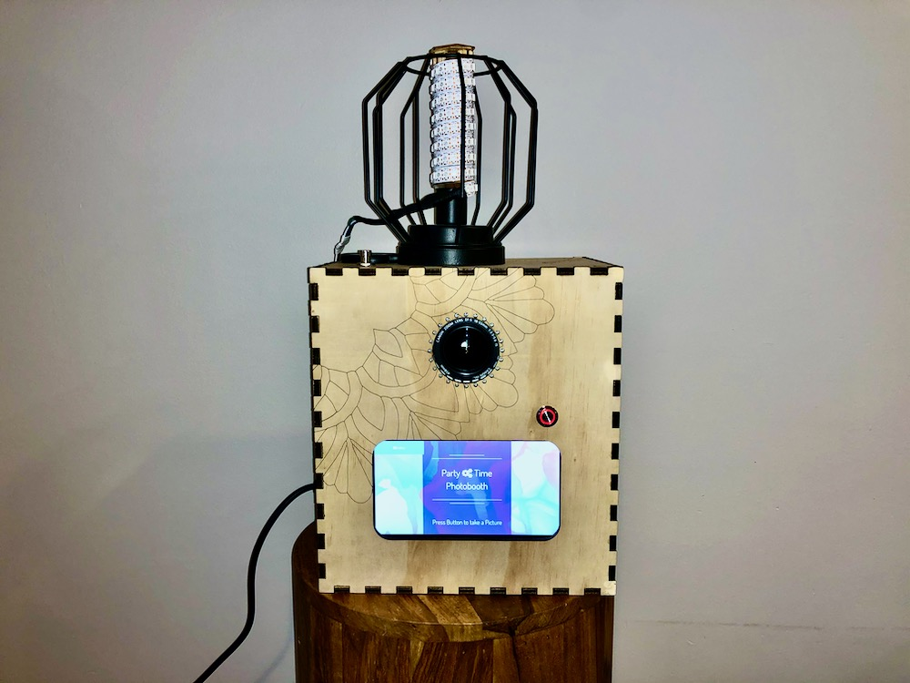

# Photobooth
<p align=center>
  
</p>
A Photobooth web interface for Raspberry Pi originally developed by Andre Rinas. A big thanks to the community behind this project for your dedicated work to continuously improve this project. Check out the main repo over here: https://github.com/andreknieriem/photobooth. They have a great wiki with detailed install instructions and FAQ if you hit any roadblocks.

This fork is my personal mod to make the photobooth work on a Raspberry Pi 3B with the official Raspberry Pi touch screen and an Arduino micro that drives a 24 NeoPixel Ring as a countdown timer and an 140 NeoPixel strip as a flash.

## Install instructions

The easiest way to install everything is to utilize the installation script that will walk you through the entire process. The default webserver for the photobooth is NGINX as it is lightweight and fast.

To use Apache as your webserver add `apache` after `install-rasbian.sh`.

Or, to use Lighttpd as your webserver add `lighttpd` after `install-rasbian.sh`.

```
wget https://raw.githubusercontent.com/jarettrude/photobooth/master/install-raspbian.sh
sudo bash install-raspbian.sh
```
### Enable button to take picture

Install dependencies
```
sudo apt install libudev-dev
sudo pip3 install python-uinput
echo "uinput" | sudo tee -a /etc/modules
```
Ensure button.py runs a system start-up.
```
sudo crontab -e
```
Add button.py to bottom of file.
```
@reboot python3 /var/www/html/button.py &
```
#### Flash an Arduino with script to run flash and count-down ring.

The `Arduino` file contains everything you need to flash an arduino. In the Arduino IDE you can add the NeoPixel library provided or download the latest build. Then open the photobooth sketch and upload it to an Arduino.

It is important to point out that communication between the Raspberry Pi and Arduino is handled across GPIO pins via logic level shifter. Comments in the sketch and button.py file indicate which GPIO pins to connect the buttons and NeoPixels too.

For my current build, I powered the NeoPixel ring and strip from an external power source to ensure they had enough juice.

## gphoto2 Update

Depending on the version of raspbian you are using, you may find the version of gphoto2 to be much lower than the current version. Check which version you have installed:
```
gphoto2 --version
```
To install the most up to date version you can use another installer script:
```
sudo apt-get remove gphoto2 libgphoto2*
wget https://raw.githubusercontent.com/gonzalo/gphoto2-updater/master/gphoto2-updater.sh && chmod +x gphoto2-updater.sh && sudo ./gphoto2-updater.sh
```
## Turn Photobooth into a WIFI hotspot

If you would like to allow your guests to download their images without connecting to your private WIFI or when there is no other WIFI around, you can turn your Raspberry Pi into setup an access point and WiFi client/station network on the single WiFi chip of the Raspberry Pi.

The default setting is to call your wifi hotspot photobooth as this is built into the photobooth prompt for guests to download images via QR code.

First head over to the hotspot directory to run the installer
```
cd /var/www/html/vendor/rpihotspot
```
There are a couple of flags you need to change from the example command below.
 - change `password` to your desired password, make it easy enough for guests to remember
 - change `country code` from `CA` to your own localization.
 - keep or change the ip address `10.10.10.10`. Remember what you change it to as we will need to update this in another file next.

```
sudo ./setup-network.sh --install-upgrade --ap-ssid="photobooth" --ap-password="password" --ap-password-encrypt
--ap-country-code="CA" --ap-ip-address="10.10.10.10" --wifi-interface="wlan0"
```
If you run into any errors setting up your hotspot we can remove all the settings and try it again. The first time I ran this I ran into an error, I reset it using the command below, then reinstalled it. It went smoothly the second time.

```
sudo ./setup-network.sh --clean
```
If you chose to use a different ip address you will need to update the photobooth.desktop shorcut before copy it from this directory to your desktop.

```
sudo sed -i 's|10.10.10.10|your_ip_here|g' photobooth.desktop
```

Next, if you configured your Raspberry Pi to boot into kiosk mode we will need to update the autostart command to reflect your ip address.

```
sudo nano /etc/xdg/lxsession/LXDE-pi/autostart
```
Find `--kiosk http://localhost/` and replace it with you ip address, e.g. `--kiosk http://10.10.10.10/`

### A note on using PHP mailer to send your guests their photos.
 - Should be obvious but the photobooth must be connected to WIFI/internet to send photos live.
 - Otherwise, tell them to check the box to send them the photo later and it will add everyone's email to a list for you.
 - I ran into a lot of issues trying to use gmail until I found out you need to generate an app password if you have 2-factor authentication on.
 - Using the following settings for gmail have been tested to work:
 ```
gmail.com
Email host adress:  smtp.gmail.com
Username:           *****@gmail.com
Port:               587
Security:           TLS
 ```

## Time to have fun!

#### A few last remarks.

There are a ton of configurable settings available out of the box. Before you set the photobooth up for an event you can head to the admin page and customize it to your needs.

`http://localhost/admin`

Unless you changed it, all photos are stored here (along with the list of guest emails if you enabled it): `/var/www/html/data/`. Save this as a shortcut so you can grab them later!

#### ENJOY!
